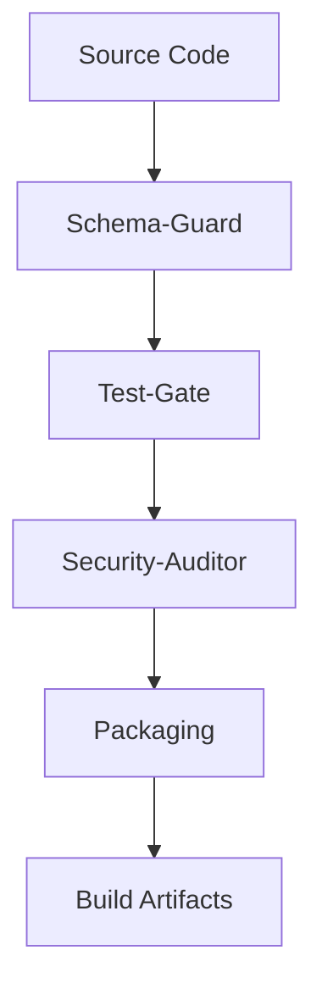
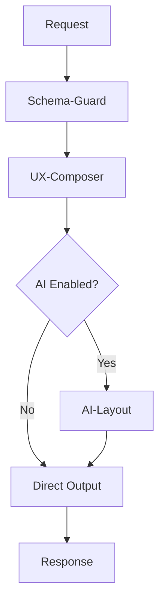

# Agent Execution Flow

> **Audience**: Developers, maintainers

This document describes how agents execute, their ordering, gates, and failure handling.

## Execution Model

Agents execute in a **pipeline model** where:
- Each agent has defined inputs and outputs
- Agents may have pre/post gates
- Some agents block progress on failure
- All executions are logged

## Agent Pipeline

```
Request
   │
   ▼
┌─────────────────┐
│  Schema-Guard   │◄── Validate input
└────────┬────────┘
         │ Pass
         ▼
┌─────────────────┐
│   UX-Composer   │◄── Compose layout
└────────┬────────┘
         │
         ▼
┌─────────────────┐
│   AI-Layout     │◄── Optional suggestions
│   (optional)    │
└────────┬────────┘
         │
         ▼
┌─────────────────┐
│   Output        │◄── Render response
└────────┬────────┘
         │
         ▼
    Response
```

## Execution Order

### Build-Time Agents



| Order | Agent | Gate Type | Blocking |
|-------|-------|-----------|----------|
| 1 | Schema-Guard | Pre-build | Yes |
| 2 | Test-Gate | Post-test | Yes |
| 3 | Security-Auditor | Pre-release | Yes |
| 4 | Packaging | Post-validation | Yes |

### Request-Time Agents



| Order | Agent | Trigger | Blocking |
|-------|-------|---------|----------|
| 1 | Schema-Guard | Every request | Yes |
| 2 | UX-Composer | Page renders | Yes |
| 3 | AI-Layout | User opt-in | No |

### Background Agents

These run continuously or on schedule:

| Agent | Trigger | Purpose |
|-------|---------|---------|
| Observability | Continuous | Monitor telemetry |
| Chaos-Injector | Scheduled | Resilience testing |
| Performance | Continuous | Track metrics |

## Gate Definitions

### Pre-Gates
Conditions that must be true before agent executes:

```json
{
  "pre_gates": {
    "schema_guard": [
      "Source files exist",
      "Schema files valid JSON"
    ],
    "packaging": [
      "All tests pass",
      "Security audit clean"
    ],
    "ai_layout": [
      "Daily budget available",
      "User has AI permission"
    ]
  }
}
```

### Post-Gates
Conditions validated after execution:

```json
{
  "post_gates": {
    "schema_guard": [
      "All schemas valid",
      "No critical errors"
    ],
    "ux_composer": [
      "Layout renders",
      "All blocks found"
    ],
    "packaging": [
      "Artifacts created",
      "SBOM generated"
    ]
  }
}
```

## Failure Handling

### Blocking Agent Failure

When a blocking agent fails:

1. **Stop pipeline** - No further agents execute
2. **Log failure** - Full context captured
3. **Return error** - Clear error to caller
4. **Alert** - If critical path

```json
{
  "failure_response": {
    "success": false,
    "agent": "schema-guard",
    "error": "Validation failed",
    "details": [...],
    "recovery": "Fix schema errors"
  }
}
```

### Non-Blocking Agent Failure

When an optional agent fails:

1. **Log warning** - Capture for debugging
2. **Continue pipeline** - Use fallback
3. **Degrade gracefully** - Skip feature

### Retry Behavior

```json
{
  "retry_policy": {
    "schema_guard": {
      "retries": 0,
      "reason": "Deterministic validation"
    },
    "ai_layout": {
      "retries": 2,
      "backoff_ms": 1000,
      "reason": "External API may timeout"
    },
    "packaging": {
      "retries": 1,
      "reason": "Build may have transient failures"
    }
  }
}
```

## Invariant Enforcement

Agents enforce system invariants:

| Invariant | Enforcing Agent |
|-----------|-----------------|
| All inputs valid | Schema-Guard |
| UI blocks approved | UX-Composer |
| AI within limits | AI-Layout |
| Security rules met | Security-Auditor |
| Telemetry emitted | Observability |
| Builds reproducible | Packaging |
| Plugins sandboxed | Plugin-Validator |

## Execution Tracing

All agent executions are traced:

```json
{
  "trace": {
    "trace_id": "abc-123",
    "span_id": "def-456",
    "agent": "ux-composer",
    "started_at": "2026-02-05T10:00:00Z",
    "duration_ms": 45,
    "status": "success",
    "inputs": {...},
    "outputs": {...}
  }
}
```

## Adding to Pipeline

To add a new agent to the pipeline:

1. Define agent spec in `agents/`
2. Specify execution order
3. Define pre/post gates
4. Set blocking behavior
5. Configure retry policy
6. Update this document

## Related

- [Agent Roster](./agent-roster.md)
- [Agent Schemas](./agent-schemas.md)
- [Architecture Deep Dive](../architecture/architecture-deep-dive.md)
