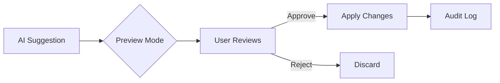

# AI Capability Matrix

> **Audience**: Admins, security reviewers, marketplace reviewers

This document defines exactly what AI can and cannot do within the 3D Commerce platform.

## Overview

AI in 3D Commerce operates under a **constrained governance model**. Every capability has:
- Explicit permission
- Defined boundaries
- Cost controls
- Audit trail

---

## Capability Summary

| Capability | Allowed | Scope | Reversible |
|------------|---------|-------|------------|
| Reorder blocks | ✅ | Within rules | ✅ |
| Toggle visibility | ✅ | Preview only | ✅ |
| Suggest layouts | ✅ | Suggestions | N/A |
| Generate descriptions | ✅ | Text only | ✅ |
| Create new blocks | ❌ | - | - |
| Modify security | ❌ | - | - |
| Access external URLs | ❌ | - | - |
| Execute code | ❌ | - | - |
| Modify payments | ❌ | - | - |
| Access user PII | ❌ | - | - |

---

## Allowed Capabilities

### 1. Block Reordering

**What**: AI can suggest reordering blocks on a page.

**Constraints**:
- Only within same container
- Cannot reorder fixed blocks (header, footer)
- Cannot reorder checkout flow
- User must approve changes

**Example**:
```json
{
  "action": "reorder",
  "from": { "blockId": "hero", "position": 0 },
  "to": { "blockId": "hero", "position": 2 },
  "reasoning": "Products above fold increase conversions"
}
```

### 2. Visibility Toggle

**What**: AI can suggest hiding/showing optional blocks.

**Constraints**:
- Cannot hide required blocks
- Preview mode only until approved
- User can always revert

**Example**:
```json
{
  "action": "toggle_visibility",
  "blockId": "testimonials",
  "visible": false,
  "reasoning": "Low engagement on mobile"
}
```

### 3. Layout Suggestions

**What**: AI can analyze layouts and suggest improvements.

**Constraints**:
- Suggestions are advisory only
- User must explicitly apply
- All suggestions logged

**Example**:
```json
{
  "suggestions": [
    {
      "type": "layout",
      "description": "Move CTA above fold",
      "confidence": 0.85,
      "expectedImpact": "+5% conversions"
    }
  ]
}
```

### 4. Content Generation

**What**: AI can generate product descriptions, titles.

**Constraints**:
- Text only (no images)
- Marked as AI-generated
- Subject to review
- Cannot generate legal/medical content

---

## Blocked Capabilities

### ❌ Create New Blocks

AI cannot add block types that don't exist.

**Reason**: Block system is contract-based; new blocks require validation.

### ❌ Modify Security

AI cannot change:
- Authentication settings
- Authorization rules
- Firewall rules
- Rate limits

**Reason**: Security must be human-controlled.

### ❌ Access External URLs

AI cannot:
- Fetch external content
- Send data to external servers
- Load external scripts

**Reason**: Prevents data exfiltration.

### ❌ Execute Code

AI cannot:
- Run arbitrary JavaScript
- Execute server-side code
- Modify application logic

**Reason**: Prevents code injection.

### ❌ Payment Operations

AI cannot:
- Modify prices
- Process refunds
- Change payment methods
- Access payment tokens

**Reason**: Financial operations require human authorization.

### ❌ Access PII

AI cannot access:
- Email addresses
- Physical addresses
- Phone numbers
- Payment details

**Reason**: Privacy protection.

---

## Approval Workflows

| Action Type | Approval Required |
|-------------|-------------------|
| Layout suggestion | View only (auto) |
| Apply layout | User click |
| Generate content | User review |
| Bulk changes | Admin approval |

### Approval Flow



---

## Rollback Capability

All AI changes can be reverted:

```json
{
  "rollback": {
    "changeId": "ch_abc123",
    "timestamp": "2026-02-05T10:00:00Z",
    "action": "revert_to_previous",
    "status": "completed"
  }
}
```

### Rollback Methods

1. **Immediate** - Undo button after change
2. **History** - Select from change history
3. **Snapshot** - Restore to saved snapshot

---

## Audit Trail

Every AI action is logged:

```json
{
  "ai_action_log": {
    "id": "log_xyz789",
    "timestamp": "2026-02-05T10:00:00Z",
    "action": "reorder_blocks",
    "actor": "ai-layout-agent",
    "input": {...},
    "output": {...},
    "cost": 0.02,
    "approved_by": "user_123",
    "reversible": true
  }
}
```

---

## Related

- [AI Governance Guide](./ai-governance-guide.md)
- [Cost Controls](./cost-controls.md)
- [ADR: AI Governance](../architecture/adr/004-ai-governance.md)
