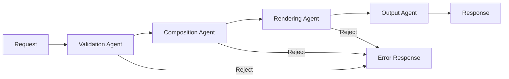

# Architecture Deep Dive

> **Audience**: Developers, maintainers, architects

## Component Architecture

### Frontend Layer

```
Frontend (React 18)
├── Pages (Server Components)
│   ├── Home
│   ├── Products
│   ├── Cart
│   ├── Checkout
│   └── Admin
├── UI Blocks (25 types)
│   ├── Layout blocks
│   ├── Commerce blocks
│   ├── Navigation blocks
│   └── AI-generated blocks
├── State Management
│   ├── Server state (React Query)
│   └── Client state (Context)
└── Theme System
    ├── CSS variables
    └── Device tokens
```

**Key Decisions**:
- Server Components for performance
- Block-based composition for extensibility
- CSS variables for theming

### Backend Layer

```
Backend (Firebase Functions)
├── API Routes
│   ├── /api/auth/*
│   ├── /api/products/*
│   ├── /api/orders/*
│   ├── /api/cart/*
│   ├── /api/ai/*
│   └── /api/admin/*
├── Agent Pipeline
│   ├── Validation Agent
│   ├── Composition Agent
│   ├── Rendering Agent
│   └── Output Agent
├── Services
│   ├── AuthService
│   ├── FirestoreService
│   ├── StorageService
│   ├── StripeService
│   └── AIService
└── Middleware
    ├── Auth verification
    ├── Rate limiting
    └── Request logging
```

**Key Decisions**:
- Serverless for auto-scaling
- Agent pipeline for complex logic
- Service layer for isolation

### Data Layer

```
Firestore Collections
├── users/
│   └── {userId}
│       ├── profile
│       └── preferences
├── products/
│   └── {productId}
│       ├── metadata
│       ├── pricing
│       └── files
├── orders/
│   └── {orderId}
│       ├── items
│       ├── payment
│       └── status
├── carts/
│   └── {cartId}
│       └── items
└── plugins/
    └── {pluginId}
        ├── config
        └── state
```

**Security Rules**:
- Users can only read/write their own data
- Products readable by all, writeable by admins
- Orders owned by customer, readable by operators
- Plugins managed by admins only

## Agent Pipeline

### Overview

Agents form the execution backbone of the system. Each agent has:
- **Mandate**: What it must do
- **Inputs**: What it receives
- **Outputs**: What it produces
- **Constraints**: What it cannot do

### Execution Flow



### Agent Inventory

| Agent | Purpose | Gate |
|-------|---------|------|
| Schema-Guard | Validate contracts | Must pass |
| UX-Composer | Generate layouts | Must pass |
| AI-Layout | Suggest layouts | Optional |
| Security-Auditor | Check security | Must pass pre-release |
| Observability | Ensure telemetry | Must pass |
| Packaging | Build artifacts | Must pass |
| Documentation | Generate docs | Must pass |

### Invariant Enforcement

Agents enforce system-wide invariants:

```json
{
  "invariants": [
    "All API calls authenticated",
    "All writes validated against schema",
    "All sensitive data masked in logs",
    "All plugins sandboxed",
    "All AI actions reversible"
  ]
}
```

## Data Flow

### Request Flow

```
1. Client Request
   ↓
2. CDN (cache check)
   ↓
3. Load Balancer
   ↓
4. Firebase Function
   ↓
5. Auth Middleware (verify token)
   ↓
6. Rate Limit Middleware (check limits)
   ↓
7. Route Handler
   ↓
8. Agent Pipeline (if complex)
   ↓
9. Service Layer
   ↓
10. Data Layer (Firestore/Storage)
   ↓
11. Response
```

### Payment Flow

```
1. Client initiates checkout
   ↓
2. Backend creates Stripe Session
   ↓
3. Client redirected to Stripe
   ↓
4. Customer pays on Stripe
   ↓
5. Stripe sends webhook
   ↓
6. Backend verifies signature
   ↓
7. Order created in Firestore
   ↓
8. Confirmation sent to customer
```

### Plugin Execution Flow

```
1. Plugin invoked by trigger
   ↓
2. Sandbox created (isolated context)
   ↓
3. Permissions checked
   ↓
4. Plugin code executed
   ↓
5. Resource limits enforced
   ↓
6. Output validated
   ↓
7. Result returned to system
```

## Security Architecture

### Authentication

- **Method**: Firebase Auth with JWT
- **Providers**: Email/password, Google OAuth
- **MFA**: Optional, recommended
- **Session**: JWT in HTTP-only cookie

### Authorization

```
RBAC Model:
├── Customer
│   ├── Read own profile
│   ├── Read products
│   ├── Manage own cart
│   └── View own orders
├── Operator
│   ├── All Customer permissions
│   ├── View all orders
│   └── Update order status
└── Admin
    ├── All Operator permissions
    ├── Manage products
    ├── Manage users
    └── Manage plugins
```

### Data Isolation

- Row-level security via Firestore rules
- No cross-tenant data access
- Audit logging for sensitive operations

## Scalability

### Auto-Scaling

| Component | Scaling Model | Limits |
|-----------|--------------|--------|
| Frontend | CDN (unlimited) | Edge caching |
| Functions | 0-100 instances | Configurable |
| Firestore | Managed | 10K writes/sec |
| Storage | Unlimited | Per-bucket quotas |

### Performance Targets

| Metric | Target |
|--------|--------|
| API latency (p95) | < 500ms |
| Page load | < 2s |
| Checkout | < 3s |
| Availability | 99.9% |

## Related Documents

- [System Overview](./system-overview.md)
- [ADR: Firebase Selection](./adr/001-firebase-selection.md)
- [ADR: Block-Based UI](./adr/002-block-based-ui.md)
- [Agent Roster](../agents/agent-roster.md)
