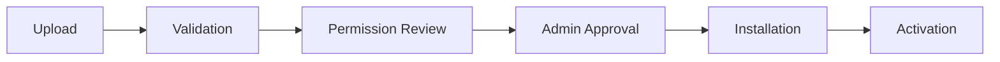

# Plugin Developer Guide

> **Audience**: Plugin developers

Welcome to plugin development for 3D Commerce! This guide covers everything you need to build, test, and publish plugins.

## Quick Start

### 1. Create Plugin Structure

```
my-plugin/
├── manifest.json       # Plugin metadata
├── index.js           # Entry point
├── components/        # UI components
│   └── MyWidget.jsx
├── hooks/             # Backend hooks
│   └── onOrder.js
└── README.md          # Documentation
```

### 2. Define Manifest

```json
{
  "id": "my-plugin",
  "name": "My Awesome Plugin",
  "version": "1.0.0",
  "description": "Does something awesome",
  "author": "Your Name",
  "compatibility": {
    "platform": ">=1.0.0"
  },
  "permissions": [
    "read_products",
    "write_orders"
  ],
  "ui": {
    "injections": [...]
  },
  "hooks": {
    "events": [...]
  }
}
```

### 3. Test Locally

```bash
# Start development mode
npm run plugin:dev my-plugin

# Plugin hot-reloads at http://localhost:3000
```

---

## Plugin Lifecycle

### Installation



### States

| State | Description |
|-------|-------------|
| `pending` | Uploaded, awaiting approval |
| `installed` | Approved, not active |
| `active` | Running in production |
| `disabled` | Manually disabled |
| `error` | Failed, needs attention |

### Lifecycle Hooks

```javascript
// index.js
export async function onInstall(context) {
  // Called once when plugin is installed
  console.log('Plugin installed');
}

export async function onActivate(context) {
  // Called when plugin becomes active
  await context.storage.set('initialized', true);
}

export async function onDeactivate(context) {
  // Called when plugin is disabled
  await cleanup();
}

export async function onUninstall(context) {
  // Called before plugin is removed
  await context.storage.clear();
}
```

---

## Permissions

### Available Permissions

| Permission | Grants |
|------------|--------|
| `read_products` | Read product catalog |
| `write_products` | Create/update products |
| `read_orders` | Read order data |
| `write_orders` | Update order status |
| `read_users` | Read user profiles |
| `read_analytics` | Access analytics data |
| `inject_ui` | Add UI components |
| `use_ai` | Call AI endpoints |

### Requesting Permissions

```json
{
  "permissions": [
    "read_products",
    "inject_ui"
  ],
  "optional_permissions": [
    "use_ai"
  ]
}
```

### Checking Permissions

```javascript
if (context.hasPermission('use_ai')) {
  const suggestion = await context.api.ai.suggest(...);
}
```

---

## UI Integration

### Injection Slots

See [Plugin UI Injection](../ui/plugin-ui-injection.md) for all slots.

### Component Example

```jsx
// components/ProductBadge.jsx
export default function ProductBadge({ product, context }) {
  const [data, setData] = useState(null);

  useEffect(() => {
    context.api.get(`/plugin-data/${product.id}`)
      .then(setData);
  }, [product.id]);

  if (!data) return null;

  return (
    <div className="badge">
      {data.label}
    </div>
  );
}
```

### Styling

```css
/* Use scoped classes */
.my-plugin .badge {
  background: var(--color-primary);
  padding: var(--space-2);
  border-radius: var(--radius-sm);
}
```

---

## Backend Hooks

### Event Hooks

```javascript
// hooks/onOrder.js
export async function onOrderCreated(order, context) {
  // Called when a new order is placed
  await context.api.post('/notifications', {
    type: 'new_order',
    orderId: order.id
  });
}

export async function onOrderStatusChanged(order, oldStatus, context) {
  // Called when order status updates
  if (order.status === 'shipped') {
    await notifyCustomer(order);
  }
}
```

### Available Events

| Event | Trigger |
|-------|---------|
| `onOrderCreated` | New order placed |
| `onOrderStatusChanged` | Order status update |
| `onProductCreated` | New product added |
| `onProductUpdated` | Product modified |
| `onUserRegistered` | New user signup |
| `onCheckoutStarted` | Checkout begins |

### Registering Hooks

```json
{
  "hooks": {
    "events": [
      {
        "event": "onOrderCreated",
        "handler": "./hooks/onOrder.js#onOrderCreated"
      }
    ]
  }
}
```

---

## Plugin API

### Context Object

```typescript
interface PluginContext {
  // Plugin identity
  pluginId: string;
  version: string;
  
  // API access
  api: {
    get(path: string): Promise<any>;
    post(path: string, data: object): Promise<any>;
    ai: AIClient;
  };
  
  // Storage (per-plugin)
  storage: {
    get(key: string): Promise<any>;
    set(key: string, value: any): Promise<void>;
    delete(key: string): Promise<void>;
    clear(): Promise<void>;
  };
  
  // Permissions
  hasPermission(name: string): boolean;
  
  // Logging
  log: {
    info(msg: string): void;
    warn(msg: string): void;
    error(msg: string): void;
  };
}
```

### API Limits

| Resource | Limit |
|----------|-------|
| API calls | 100/minute |
| Storage | 10MB |
| CPU time | 5s per hook |
| Memory | 128MB |

---

## Testing

### Unit Tests

```javascript
// tests/ProductBadge.test.js
import { render } from '@testing-library/react';
import ProductBadge from '../components/ProductBadge';

test('renders badge with label', async () => {
  const mockContext = createMockContext({
    api: { get: () => Promise.resolve({ label: 'New' }) }
  });

  const { findByText } = render(
    <ProductBadge 
      product={{ id: '123' }} 
      context={mockContext} 
    />
  );

  expect(await findByText('New')).toBeInTheDocument();
});
```

### Integration Tests

```bash
npm run plugin:test my-plugin
```

---

## Publishing

### Checklist

- [ ] Version follows semver
- [ ] Manifest complete
- [ ] Permissions minimized
- [ ] README documented
- [ ] Tests passing
- [ ] No security issues

### Submit

```bash
npm run plugin:publish my-plugin
```

### Review Process

1. Automated security scan
2. Permission review
3. Manual code review (if needed)
4. Publication to marketplace

---

## Version Compatibility

### Platform Versions

```json
{
  "compatibility": {
    "platform": ">=1.0.0 <2.0.0"
  }
}
```

### Breaking Changes

When the platform makes breaking changes:
1. Plugins have 6-month migration period
2. Compatibility warnings shown to admins
3. After period, incompatible plugins disabled

---

## Related

- [Plugin UI Injection](../ui/plugin-ui-injection.md)
- [Security Boundaries](./security-boundaries.md)
- [Plugin Templates](./plugin-templates/)
